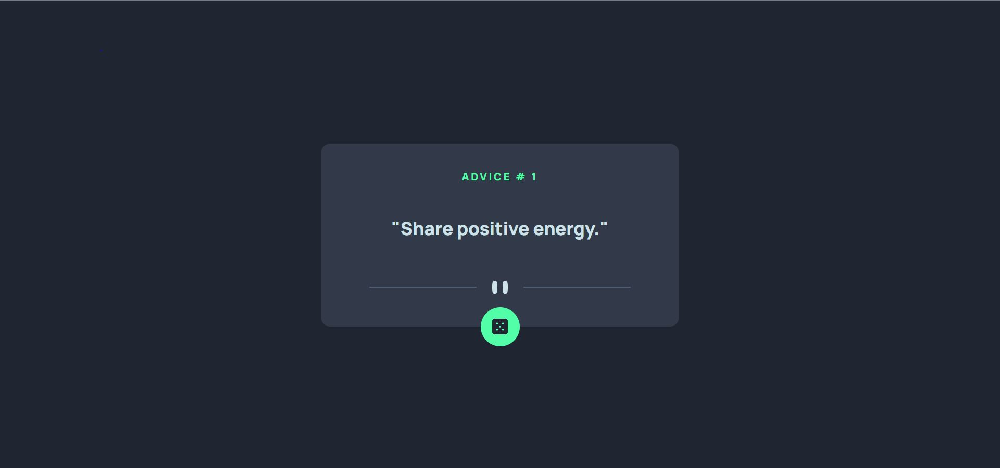
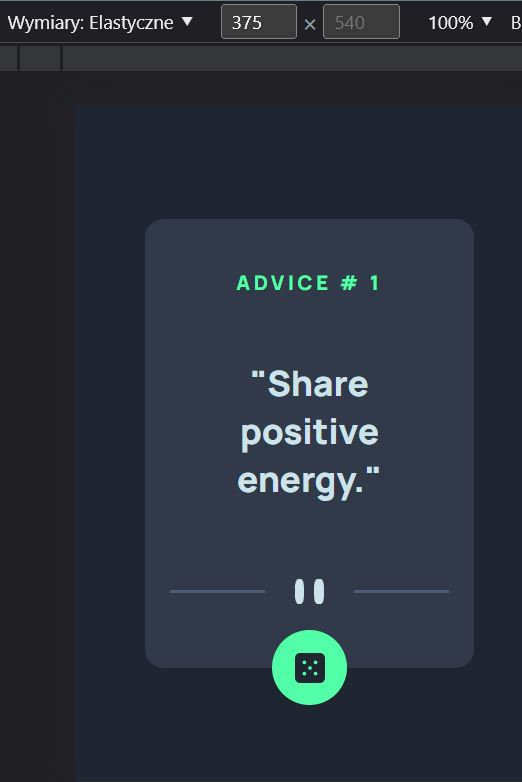

# Frontend Mentor - Advice generator app solution

This is a solution to the [Advice generator app challenge on Frontend Mentor](https://www.frontendmentor.io/challenges/advice-generator-app-QdUG-13db). Frontend Mentor challenges help you improve your coding skills by building realistic projects.

## Table of contents

- [Overview](#overview)
  - [The challenge](#the-challenge)
  - [Screenshot](#screenshot)
  - [Links](#links)
  - [Built with](#built-with)
- [Author](#author)

**Note: Delete this note and update the table of contents based on what sections you keep.**

## Overview

My overall impression of this project is very good. This is my first experience in writing code and creating a website according to introctions and with a ready design. As for me, I managet to do it my way, not necessarily the right one, but I'm very happy with what I got.

### The challenge

Users should be able to:

- View the optimal layout for the app depending on their device's screen size
- See hover states for all interactive elements on the page
- Generate a new piece of advice by clicking the dice icon

### Screenshot

 - the screenshot of desktop version
 - the screenshot of mobile version

### Links

- Solution URL: 
- Live Site URL: 

### Built with

- Semantic HTML5 markup
- CSS custom properties
- Flexbox
- Mobile-first workflow
- Java Script

## Author

- Git Hub - [Irina-Dehtiarenko](https://github.com/Irina-Dehtiarenko)
- Frontend Mentor - [@Irina-Dehtiarenko](https://www.frontendmentor.io/profile/Irina-Dehtiarenko)
- Facebook - [Iryna Dehtiarenko](https://www.facebook.com/profile.php?id=100009410450333)
